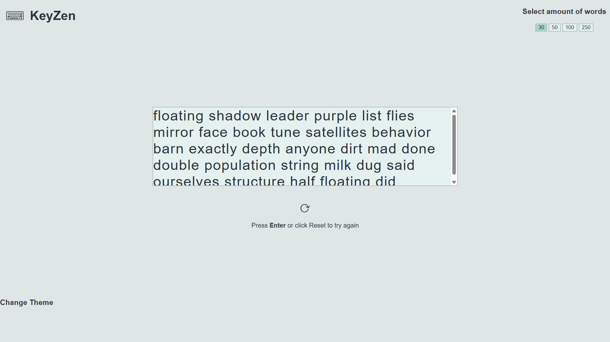
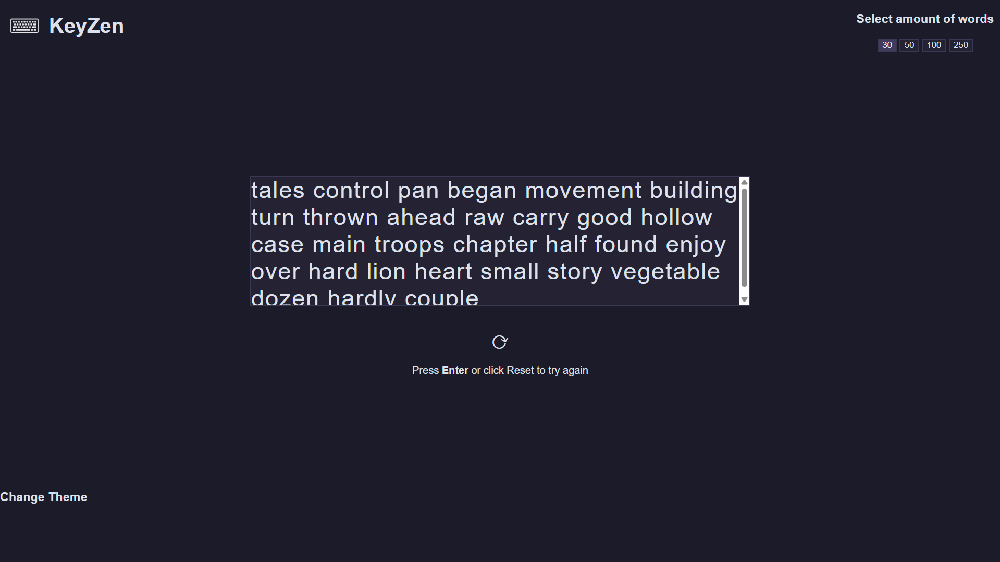

# KeyZen - Type in Tranquility

KeyZen is a modern, minimalist typing practice application designed to help users improve their typing speed and accuracy in a serene, distraction-free environment. Unlike traditional typing tutors that focus solely on speed, KeyZen emphasizes the meditative aspect of typing with carefully crafted themes that create a calming experience while building essential keyboard skills.

**🌐 [Try KeyZen Online](https://octavio-js.github.io/keyzen)**

## 📋 Table of Contents
- [Overview](#overview)
- [Core Features](#core-features)
- [Screenshots](#screenshots)
- [Getting Started](#getting-started)
- [Usage Guide](#usage-guide)
- [Technical Architecture](#technical-architecture)
- [Contributing](#contributing)

## Overview

KeyZen transforms the mundane task of typing practice into a mindful experience. The application features performance tracking, customizable word counts, and a collection of beautifully designed themes that adapt to both light and dark preferences. Whether you're a beginner looking to build fundamental typing skills or an advanced typist seeking to refine your accuracy, KeyZen provides the perfect environment for practice.

## Core Features

### 🎯 Performance Metrics
- **Accuracy Tracking**: Monitor your typing precision with accuracy percentages
- **Detailed Statistics**: View comprehensive breakdowns including total characters, correct/incorrect keystrokes, and missed spaces
- **Visual Feedback**: Immediate color-coded feedback shows correct, incorrect, and upcoming characters

### 📊 Customizable Practice Sessions
- **Flexible Word Counts**: Choose from 30, 50, 100, or 250 words per session
- **Random Word Generation**: Practice with a diverse vocabulary of over 1,000 carefully selected words
- **Session Reset**: Easily restart practice sessions with the reset button or Enter key

### 🎨 Immersive Theme System
- **10 Beautiful Themes**: 5 light and 5 dark themes designed for optimal eye comfort
- **Light Themes**: Soft Focus, Sunrise Grove, Crystal Lake, Lavender Bloom, Zen Dunes
- **Dark Themes**: Night Lotus, Shadow Fern, Muted Tides, Charcoal Tea, Velvet Dusk
- **Theme Persistence**: Your chosen theme is automatically saved and restored

### 🖥️ Responsive Design
- **Smooth Scrolling**: Automatic text scrolling keeps the current character in view
- **Keyboard Navigation**: Full keyboard support for all interactions
- **Mobile Friendly**: Responsive design works on desktop, tablet, and mobile devices

## Screenshots

### ☀️ Light Theme


### 🌘 Dark Theme


### 🎥 Video
<video autoplay loop muted>
  <source src="./resources/media/page.mp4" type="video/mp4">
</video>

## Getting Started

### Prerequisites
- A modern web browser (Chrome, Firefox, Safari, Edge)
- No additional software installation required

### Quick Start
1. **Online**: Visit [KeyZen](https://octavio-js.github.io/keyzen) to start typing immediately
2. **Local**: Download and open `index.html` in any modern browser


### Local Installation
1. Clone the repository:
   ```bash
   git clone https://github.com/octavio-js/keyzen.git
   cd keyzen
   ```

2. Open the application:
   - **Option 1**: Use the `Live Server` extension in VS Code
   - **Option 2**: Double-click `index.html` to open in your default browser
   - **Option 3**: Open `index.html` directly in your browser

### Running the Application
The application runs entirely in the browser with no server-side dependencies. Simply open `index.html` in any modern web browser to start practicing immediately.

## Usage Guide

### Starting a Practice Session
1. **Select Word Count**: Choose your desired session length (30, 50, 100, or 250 words)
2. **Follow the Flow**: Type the highlighted characters as they appear
3. **Monitor Progress**: Watch your accuracy and statistics

### Understanding the Interface
- **Text Display**: The main typing area shows the practice text with color-coded feedback
- **Statistics Panel**: Located below the text area, showing accuracy and detailed stats
- **Theme Selector**: Accessible via the footer, offering light and dark theme options
- **Reset Button**: Circular arrow icon to restart your current session. You can also just press the `Enter` key on your keyboard

### Performance Metrics
- **Accuracy**: Percentage of correctly typed characters
- **Statistics Format**: `Total / Correct / Incorrect / Missed Spaces`

### Theme Customization
1. Click "Change Theme" in the footer
2. Choose between Light or Dark theme categories
3. Select your preferred color scheme
4. Your choice is automatically saved for future sessions

## Technical Architecture

### Frontend Stack
- **HTML**: Semantic markup for accessibility
- **CSS**: Custom properties (CSS variables) for dynamic theming
- **Vanilla JavaScript**: No frameworks required, ensuring fast loading and broad compatibility

### Project Structure
```
keyzen/
├── index.html              # Main application entry point
├── README.md              # Project documentation
└── resources/
    ├── css/
    │   └── styles.css     # Main stylesheet with theme system
    ├── js/
    │   ├── script.js      # Main application entry point
    │   └── modules/       # Modular JavaScript components
    │       ├── constants.js      # Application constants and configuration
    │       ├── domElements.js    # DOM element references and selectors
    │       ├── stateManager.js   # Application state management
    │       ├── statistics.js     # Performance tracking and statistics
    │       ├── themeManager.js   # Theme system and customization
    │       ├── typingEngine.js  # Core typing logic and validation
    │       ├── uiManager.js     # User interface management
    │       └── wordGenerator.js # Word generation and text processing
    └── media/
        ├── icon.ico       # Application icon
        ├── black-icon.png # Light theme logo
        ├── white-icon.png # Dark theme logo
        ├── lightview.png # Screenshot of page with light theme
        ├── blackview.png # Screenshot of page with dark theme
        └── page.mp4 # A preview of the page being used
```

### Key Components

#### Theme System
The application uses CSS custom properties to implement a dynamic theming system:
- 10 predefined themes with carefully chosen color palettes
- Automatic theme persistence using localStorage

#### Word Generation
- JS-based word database with over 1,000 common English words
- Random selection algorithm for varied practice sessions
- Dynamic text rendering with individual character tracking

#### Performance Tracking
- Comprehensive statistics including missed spaces
- Visual feedback system with immediate color coding

## Contributing

We welcome contributions from the community! Whether you're fixing bugs, adding features, or improving documentation, your help makes KeyZen better for everyone.

### How to Contribute

1. **Fork the Repository**: Create your own fork of the project
2. **Create a Feature Branch**: `git checkout -b feature/amazing-feature`
3. **Make Your Changes**: Implement your improvements
4. **Test Thoroughly**: Ensure your changes work across different browsers
5. **Commit Your Changes**: `git commit -m 'Add amazing feature'`
6. **Push to Your Branch**: `git push origin feature/amazing-feature`
7. **Open a Pull Request**: Describe your changes and their benefits

### Areas for Contribution
- **New Themes**: Create additional light and dark themes
- **Word Database**: Add more words or support for different languages
- **Performance Features**: Implement WPM tracking, typing patterns analysis, real-time statistics update
- **Accessibility**: Improve keyboard navigation and screen reader support
- **Documentation**: Enhance guides, add tutorials, or improve code comments
- **Smooth Transitions**: Add smooth transitions across the page for a better experience
- **Bug Fixes**: Help identify and fix any issues
- **UI/UX Improvements**: Suggest and implement interface enhancements

These are just some examples of features that can be added! Anyone can come with their own ideas for features.

### Reporting Issues
Before creating an issue, please:
1. Check if the issue has already been reported
2. Provide a clear description of the problem
3. Include steps to reproduce the issue
4. Specify your browser and operating system

### Development Guidelines
- Follow existing code style and naming conventions
- Test changes across multiple browsers
- Ensure responsive design compatibility
- Maintain the application's minimalist aesthetic
- Add appropriate comments for complex logic

### Code of Conduct
We are committed to providing a welcoming and inclusive environment for all contributors. Please be respectful and constructive in all interactions.

---

**Happy typing!** ⌨️🎯✨

For questions, suggestions, or to report issues, please open an issue on GitHub or reach out directly to me.